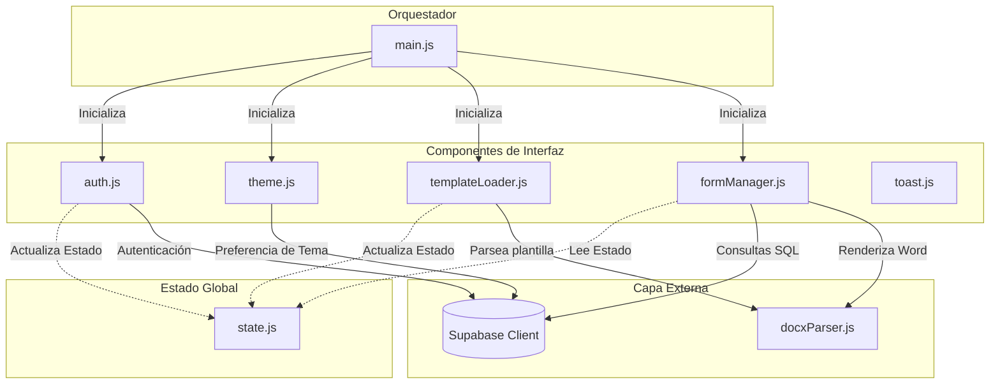
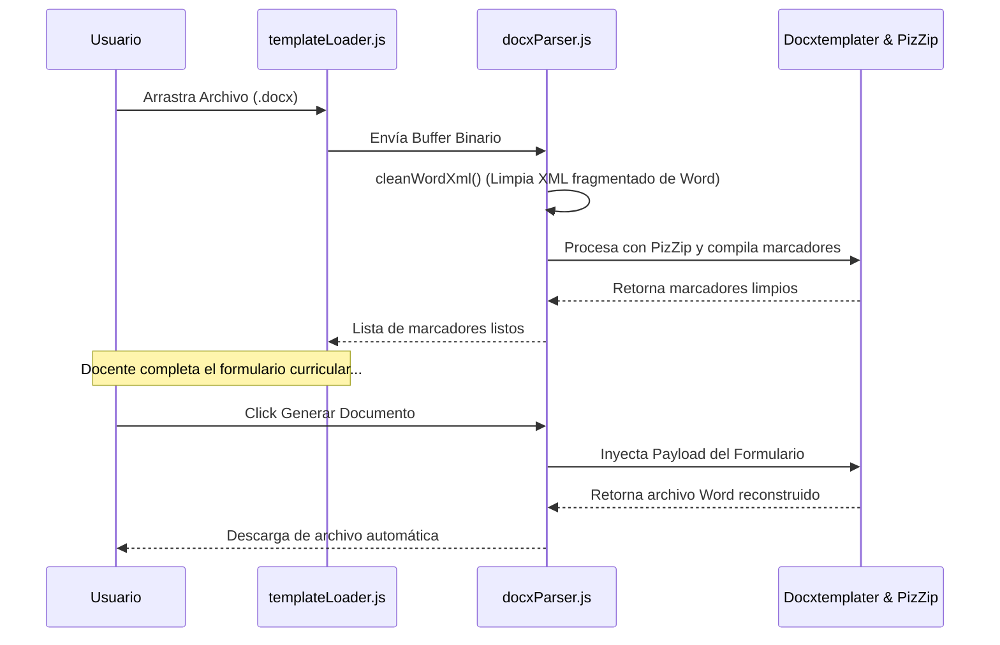

# Documentación de la Arquitectura del Sistema - SesiónBuilder 🏗️⚙️

Este documento describe la arquitectura de software, el flujo de datos y el modelo de diseño implementado en la aplicación **SesiónBuilder**.

---

## 🎨 1. Filosofía y Estilo Arquitectónico

La aplicación está diseñada para ser **100% estática y serverless**, lo que permite su distribución instantánea en hosting estáticos (como GitHub Pages) delegando la lógica de backend y base de datos a servicios de nube autogestionados (**Supabase**).

### Principales Decisiones de Diseño:
*   **Sin Servidor Intermedio (Backendless)**: Todo el procesamiento de plantillas Word se ejecuta en el navegador del docente (lado del cliente).
*   **Arquitectura Orientada a Componentes (Vanilla JS)**: El código no estructurado original ha sido separado en componentes desacoplados con responsabilidades únicas y aislamiento de estilos.
*   **Comunicación Basada en Eventos**: Para evitar acoplamientos circulares entre módulos de JavaScript, se utiliza un bus de eventos nativo sobre el objeto `document`.

---

## 🧱 2. Estructura de Componentes y Estado

El sistema se divide en tres capas principales: **Estado**, **Componentes de Interfaz** y **Controlador Orquestador**.

### 2.1 Estado Global (`state.js`)
El estado global es reactivo por flujo mas no complejo (sin librerías como Redux). Es una única fuente de verdad compartida por los módulos que almacena:
*   `templateBuffer`: El buffer binario del archivo Word cargado en memoria.
*   `detectedMarkers`: Lista de variables `{MARCADOR}` extraídos de la plantilla.
*   `availableAreas`: Áreas curriculares precargadas al iniciar la sesión.

---

## 📢 3. Comunicación Inter-Componentes (Eventos Custom)

Para evitar la dependencia mutua y asegurar la modularidad, los componentes se comunican enviando eventos personalizados en el DOM:

### 3.1 Evento: `'app:template-loaded'`
Disparado por `templateLoader.js` cuando se carga y procesa con éxito una plantilla `.docx`.
*   **Escuchado por**: `formManager.js`.
*   **Acción**: Oculta/Muestra el bloque secundario de competencias analizando `state.detectedMarkers` y carga los selectores de datos iniciales.

### 3.2 Evento: `'app:logout'`
Disparado por `auth.js` al cerrar la sesión de Supabase.
*   **Escuchado por**: `templateLoader.js` y `formManager.js`.
*   **Acción**: Limpia el buffer de plantilla en memoria, reinicia los selectores del formulario a sus estados iniciales y oculta el panel principal de generación.

---

## 📝 4. Motor de Procesamiento y Relleno de Word

Una de las piezas clave es el parseador y generador cliente implementado en `docxParser.js`.

### Sanitizador Automático de XML (`cleanWordXml`):
Microsoft Word suele fragmentar internamente los marcadores cuando se corrigen errores ortográficos o se edita el texto (ej. `{EDAD}` puede dividirse internamente en `<w:t>{</w:t><w:t>EDAD</w:t><w:t>}</w:t>` dentro del XML). Esto rompe motores de plantillas tradicionales como **Docxtemplater**.

Para solucionar esto, nuestro parser ejecuta un **sanitizador en tiempo real** que:
1.  Busca y elimina etiquetas de control de ortografía y formato intermedio de Word (`<w:proofErr>`, `<w:noProof>`, etc.).
2.  Unifica los nodos de texto fragmentados dentro del XML para consolidar los marcadores `{...}` antes de que sean leídos por la librería de compilación.
3.  Evita errores de sintaxis comunes como `Duplicate open tag` de forma transparente para el usuario final.
