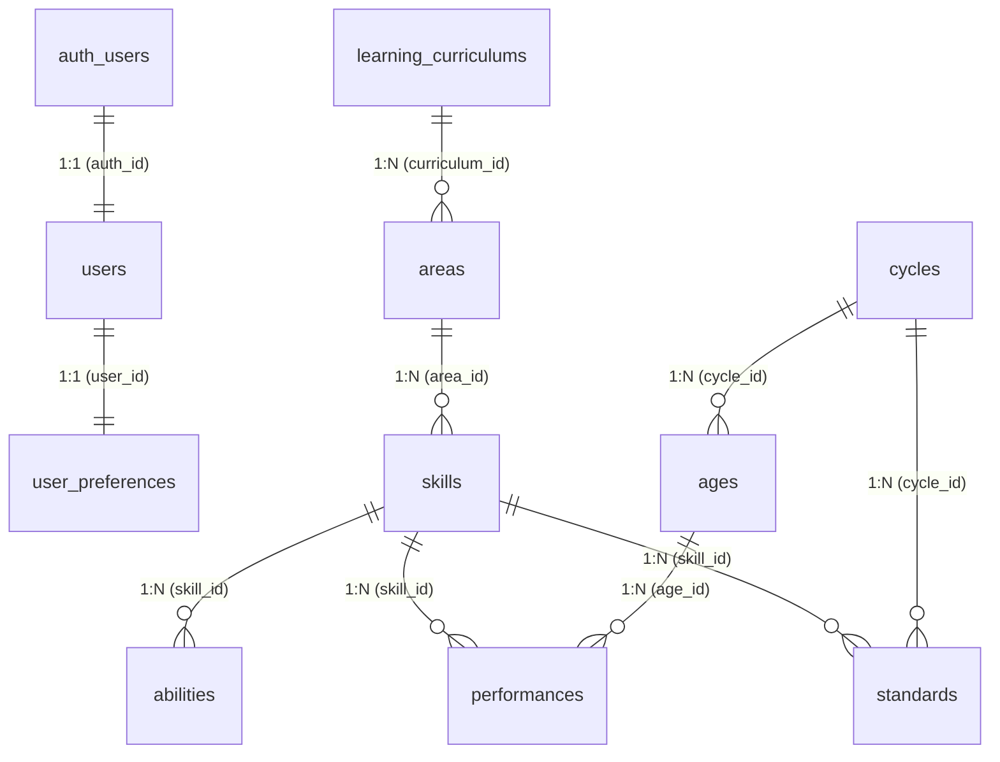

# Documentación del Esquema de Base de Datos - Supabase 🗄️⚡

Esta documentación describe la estructura de tablas, relaciones, políticas de seguridad a nivel de fila (RLS) y triggers automáticos implementados en la base de datos PostgreSQL de **Supabase** para el proyecto **SesiónBuilder**.

---

## 🗺️ Diagrama de Relaciones de la Base de Datos



---

## 📋 1. Diccionario de Tablas

### 1.1 Tabla: `users`
Almacena la información de perfil público de los docentes, vinculada directamente con el sistema de autenticación de Supabase (`auth.users`).

| Columna | Tipo | Restricciones / Índices | Descripción |
| :--- | :--- | :--- | :--- |
| `id` | `uuid` | `PRIMARY KEY`, `REFERENCES auth.users(id) ON DELETE CASCADE` | Identificador único provisto por Supabase Auth. |
| `name` | `text` | - | Nombre completo del docente (sincronizado desde metadatos OAuth/registro). |
| `email` | `text` | `UNIQUE` | Correo electrónico principal del docente. |
| `role` | `text` | `DEFAULT 'user'`, `CHECK (role IN ('user', 'admin'))` | Rol en el sistema (por ahora, usuarios y administradores). |
| `created_at` | `timestamptz` | `DEFAULT now()`, `NOT NULL` | Fecha de creación del registro. |

---

### 1.2 Tabla: `user_preferences`
Almacena configuraciones personalizadas del usuario, como el tema visual (oscuro/claro) y plantillas personalizadas.

| Columna | Tipo | Restricciones / Índices | Descripción |
| :--- | :--- | :--- | :--- |
| `id` | `uuid` | `PRIMARY KEY`, `REFERENCES users(id) ON DELETE CASCADE` | Identificador único referenciado a `users.id`. |
| `theme` | `text` | `DEFAULT 'light'`, `CHECK (theme IN ('light', 'dark'))` | Tema de interfaz seleccionado por el usuario. |
| `template` | `jsonb` | `DEFAULT '{}'::jsonb` | Metadatos o rutas de las plantillas Word personalizadas cargadas por el docente. |
| `updated_at` | `timestamptz` | `DEFAULT now()`, `NOT NULL` | Última actualización de preferencias. |

---

### 1.3 Tablas Curriculares

#### `learning_curriculums` (Currículos Educativos)
*   `id` (`int`, PK autoincrementable)
*   `name` (`varchar(100)`, `UNIQUE`, `NOT NULL`) - Nombre del currículo (Ej. "Currículo Nacional Inicial 2026").
*   `created_at` (`timestamptz`)

#### `areas` (Áreas Curriculares)
*   `id` (`int`, PK autoincrementable)
*   `learning_curriculum_id` (`int`, FK a `learning_curriculums.id` con cascade delete)
*   `name` (`varchar(100)`, `NOT NULL`)
*   *Restricción*: `UNIQUE (learning_curriculum_id, name)` (Evita áreas repetidas por currículo).

#### `skills` (Competencias por Área)
*   `id` (`int`, PK autoincrementable)
*   `area_id` (`int`, FK a `areas.id` con cascade delete)
*   `name` (`varchar(100)`, `NOT NULL`)
*   `description` (`text`, `NOT NULL`)
*   *Restricción*: `UNIQUE (area_id, name)` (Evita competencias idénticas en la misma área).

#### `abilities` (Capacidades asociadas a una Competencia)
*   `id` (`int`, PK autoincrementable)
*   `skill_id` (`int`, FK a `skills.id` con cascade delete)
*   `name` (`varchar(100)`, `NOT NULL`)
*   *Restricción*: `UNIQUE (skill_id, name)` (Evita duplicar capacidades en la misma competencia).

#### `cycles` (Ciclos de Educación)
*   `id` (`int`, PK autoincrementable)
*   `name` (`varchar(100)`, `UNIQUE`, `NOT NULL`) - Nombre del ciclo (Ej. "Ciclo I", "Ciclo II").
*   `created_at` (`timestamptz`)

#### `ages` (Edades/Años por Ciclo)
*   `id` (`int`, PK autoincrementable)
*   `name` (`varchar(100)`, `NOT NULL`) - Ej. "3 años", "4 años", "5 años".
*   `cycle_id` (`int`, FK a `cycles.id` con cascade delete)
*   *Restricción*: `UNIQUE (cycle_id, name)`

#### `standards` (Estándares de Aprendizaje por Competencia y Ciclo)
*   `id` (`int`, PK autoincrementable)
*   `skill_id` (`int`, FK a `skills.id` con cascade delete)
*   `cycle_id` (`int`, FK a `cycles.id` con cascade delete)
*   `description` (`text`, `NOT NULL`)
*   *Restricción*: `UNIQUE (skill_id, cycle_id)` (Un solo estándar por competencia/ciclo).

#### `performances` (Desempeños por Edad y Competencia)
*   `id` (`int`, PK autoincrementable)
*   `skill_id` (`int`, FK a `skills.id` con cascade delete)
*   `age_id` (`int`, FK a `ages.id` con cascade delete)
*   `description` (`text`, `NOT NULL`)

---

## 🔒 2. Seguridad de Acceso: Row Level Security (RLS)

Todas las tablas de la base de datos tienen activado RLS para impedir accesos no autorizados.

### Tablas Curriculares (Lectura Pública)
Las tablas `learning_curriculums`, `areas`, `skills`, `abilities`, `cycles`, `ages`, `performances` y `standards` tienen la siguiente política única:
```sql
CREATE POLICY "Permitir lectura pública" ON [tabla]
  FOR SELECT USING (true);
```
*Esto permite que usuarios anónimos o registrados consulten el currículo escolar desde el cliente de forma directa.*

### Tablas de Usuarios (Acceso Privado)
Para proteger la privacidad de los datos personales y preferencias de los docentes, se aplican políticas estrictas:

*   **Tabla `users`**:
    *   `SELECT`: Permitido solo si el ID del registro coincide con la sesión (`auth.uid() = id`).
    *   `UPDATE`: Permitido solo para modificar la propia fila (`auth.uid() = id`).
*   **Tabla `user_preferences`**:
    *   `SELECT`: Permitido solo si `auth.uid() = id`.
    *   `UPDATE`: Permitido solo si `auth.uid() = id`.
    *   `INSERT`: Permitido si `auth.uid() = id` (aunque la inserción suele ser automática mediante triggers).

---

## ⚙️ 3. Sincronización Automática: Funciones y Triggers

Para evitar la gestión manual de perfiles en el cliente, la base de datos sincroniza automáticamente los usuarios de Supabase Auth usando triggers de Postgres.

### 3.1 Trigger: `on_auth_user_created`
*   **Evento**: `AFTER INSERT ON auth.users`
*   **Función**: `handle_new_auth_user()`
*   **Configuración**: `SECURITY DEFINER`, `search_path = public`
*   **Lógica**:
    1.  Se dispara cuando un usuario se registra con éxito (ya sea vía email o proveedor OAuth).
    2.  Inserta la fila en la tabla `public.users` con el correo y el nombre extraído de `NEW.raw_user_meta_data` (resolviendo conflictos si el usuario ya existiera).

### 3.2 Trigger: `on_user_created`
*   **Evento**: `AFTER INSERT ON public.users`
*   **Función**: `handle_new_user()`
*   **Configuración**: `SECURITY DEFINER`, `search_path = public`
*   **Lógica**:
    1.  Se dispara al insertarse un perfil en `public.users`.
    2.  Inserta automáticamente la configuración inicial en `public.user_preferences` asociada al ID del usuario, usando el tema `light` por defecto.
